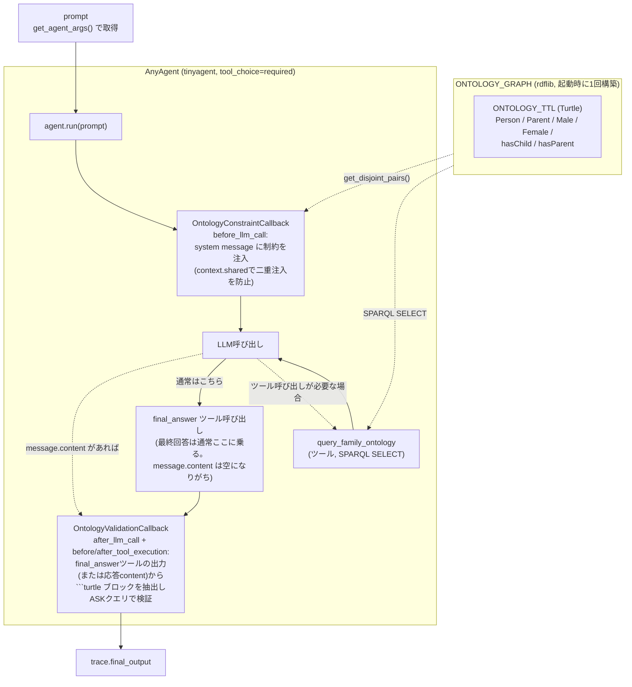

# オントロジー制約コールバックパターン（agent_ontology.py）

any-agent の `before_llm_call`/`after_llm_call` コールバックを使って、ドメインオントロジー（家系図、Turtle形式）の制約をLLM呼び出しに注入し、応答内の事実を rdflib で検証するサンプルです。`references/ontology/ontology_callback_demo.py` の擬似コード（Perplexityとの調査対話から生成）を、このリポジトリの実際の `any-agent`（1.18.0）API と `agent_config.get_agent_args()` に沿って実装し直したものが `agent_ontology.py` です。

## アーキテクチャ



**ポイント:**

- オントロジー（`ONTOLOGY_GRAPH`）は起動時に一度だけ構築され、プロンプト注入・ツール応答・違反検証の3箇所すべてで共有される「単一の真実源」です。素なクラスの組（`owl:disjointWith`）はハードコードせず `get_disjoint_pairs()` で毎回オントロジーから取得します。
- `before_llm_call` の `kwargs["messages"]` は、実行中のLLM呼び出しに使われるものと同一のlistオブジェクトです。インプレースで書き換えることで実際のプロンプトに反映されます（再代入では反映されません）。
- `context.shared` を使って「このrunで既に注入済みか」を記録し、ツール呼び出しループで `before_llm_call` が複数回呼ばれても制約テキストが多重に注入されないようにしています。
- 検証はLLM自身に応答末尾で ```turtle``` ブロックとして事実を書かせ、それをrdflibでオントロジーと合成して `ASK` クエリで矛盾を検出する方式です。厳密なOWL推論（owlready2/HermiT等）ではなく、素なクラスの同時所属のような明示的な制約違反を検出する軽量な検証です。
- `OntologyValidationCallback` は当初 `after_llm_call`（`message.content`）だけを見ていましたが、実LLMでの検証（Task 7）で「一度も違反を検出できない」ことが判明しました。原因は、any-agentの `TinyAgent` が既定で `tool_choice="required"` で動くため、LLMの最終回答が常に `final_answer` というツールの呼び出しとして返り、`message.content` には入らないためです。**コールバックを「どのフック点に置くか」は、プロンプトへの書き込み（`before_llm_call`一箇所で足りる）と、応答の読み取り（実行系がテキストをどの経路で運ぶか次第で複数のフックが必要になりうる）とで対称ではない**、という教訓を示す実例です。修正後は `before_tool_execution`/`after_tool_execution` も併用し、`final_answer` ツールの出力を検証することで解決しています。

## 実行方法

```bash
uv run agent_ontology.py
uv run agent_ontology.py "カスタムプロンプト"
```

`model_id` / `api_base` / `api_key` は他のデモと同じく `agent_config.get_agent_args()`（`.env` / CLI引数）から取得します。

## 次のステップの例

- `query_family_ontology` を実SPARQLエンドポイント（Apache Jena、GraphDB等）に接続する。
- `find_violations` を owlready2 + HermiT による本格的なOWL論理推論に置き換える。
- ストリーミング版 `agent_ontology_stream.py` を作る（`agent_router_stream.py` を参考に）。
