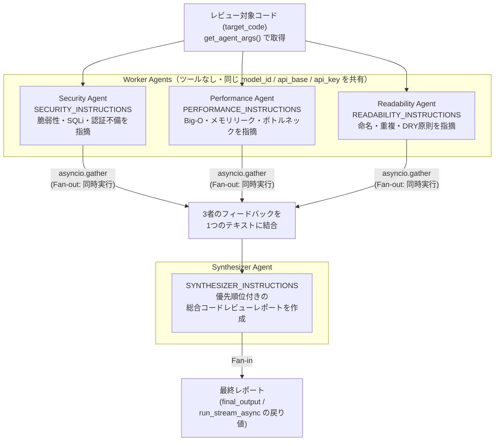

# Parallelizationパターン（agent_parallel.py / agent_parallel_stream.py）

同じ入力を複数の「専門ワーカーエージェント」に同時並行（fan-out）で評価させ、出揃った結果を1つの
「Synthesizer（集約）エージェント」でまとめ上げる（fan-in）マルチエージェントパターンのサンプルです。
`references/parallelization.py` の擬似コードを、このリポジトリの実際の `any-agent` API（`AgentConfig` /
`AnyAgent.create("tinyagent", ...)` / `AnyAgent.run_async()` / `StreamingTinyAgent`）と
`agent_config.get_agent_args()` に沿って実装したものが `agent_parallel.py`（同期版）・
`agent_parallel_stream.py`（ストリーミング版）です。

題材はコードレビュー: security / performance / readability の3人の専門家が同じコードを別々の観点で
同時にレビューし、テクニカルリード役の Synthesizer が優先順位付きの統合レポートにまとめます。

## アーキテクチャ



**ポイント:**

- `model_id` / `api_base` / `api_key` は `agent_config.get_agent_args()` を**1回だけ**呼び出し、
  4つのエージェント（3ワーカー + Synthesizer）すべてで共有します（`agent_router.py` と同じ、ローカル
  1バックエンド構成のこのリポジトリの流儀）。
- 3つのWorker Agentはツールを持たず、システムプロンプトだけで評価を行う「テキスト専用エージェント」です。
  外部サービス（SearXNGなど）への依存がないため、ローカルLLMバックエンドだけで動作します。
- `references/parallelization.py` の擬似コードは `asyncio.gather` で3エージェントを**同時に**呼び出す
  Fan-out、結果を結合してSynthesizerに渡すFan-inという2段構成を示しており、`agent_parallel.py` では
  `AnyAgent.run_async()` を使ってこれをそのまま本物の非同期並列実行として実装しています。
- 同期版（`agent_parallel.py`）は `asyncio.gather` の完了を待ってから結果を一括表示するだけのシンプルな
  構成、ストリーミング版（`agent_parallel_stream.py`）はWorkerの出力を行単位でラベル付けしながら並列に
  ライブ表示し、Synthesizerの最終レポートはトークン単位でライブ表示します。

## ワーカーエージェント

| エージェント | 役割 | 観点 |
|---|---|---|
| Security Agent | 脆弱性の指摘 | SQLインジェクション、認証不備など |
| Performance Agent | パフォーマンスの指摘 | 時間・空間計算量、メモリリーク、ボトルネック |
| Readability Agent | 可読性の指摘 | 命名規則、コード重複、モジュール化、DRY原則 |
| Synthesizer Agent | 統合レポート作成（Fan-in） | 3者の指摘を優先順位付きで1つのレポートにまとめる |

## サンプル実行

デフォルトプロンプト（SQLインジェクション＋非効率なループを含むサンプルコード）で実行する例です。

```bash
uv run agent_parallel.py
```

3つのWorker Agentが並列にレビューを行った後、Synthesizer Agentが以下のような統合レポートを出力します。

```
▶ 3つの専門エージェントで並列評価中...
▶ すべての評価が出揃いました。集約エージェントがレポートを作成中...

================【最終レビューレポート】================
1. [優先度: 高] SQLインジェクションの脆弱性 — 文字列結合によるクエリ構築を
   パラメータ化クエリに置き換える
2. [優先度: 中] ループ内での `in` によるリスト検索は O(n^2) — set を使う
3. [優先度: 低] 変数名・関数名の一貫性を改善
...
```

独自のコードをレビューしたい場合は、プロンプトとしてコード文字列を渡します。

```bash
uv run agent_parallel.py "def add(a, b):\n    return a+b"
```

## ストリーミング版

同じプロンプトを `agent_parallel_stream.py` に渡すと、3つのWorker Agentのトークンが `[security]` /
`[performance]` / `[readability]` のラベル付きで行単位に並列表示され、最後にSynthesizerの統合レポート
がトークン単位でライブ表示されます。

```bash
uv run agent_parallel_stream.py
```

```
▶ 3つの専門エージェントで並列評価中...

[security] 1. SQLインジェクションの脆弱性: クエリが文字列結合で構築されている
[performance] 1. ループ内の `in` 検索により O(n^2) の計算量になっている
[readability] 1. `r` のような単一文字変数名は意味が分かりにくい
[security] 2. 例外処理がなく、DB接続エラー時にクラッシュする可能性がある
...

▶ すべての評価が出揃いました。集約エージェントがレポートを作成中...

1. [優先度: 高] SQLインジェクションの脆弱性...

最終レポート: 1. [優先度: 高] SQLインジェクションの脆弱性...
```

Worker Agentはツールを持たないため、`StreamingTinyAgent.run_stream_async()` のツール呼び出しループは
不要です。そのため `agent_parallel_stream.py` では `_stream_worker()` という簡易版のストリーミング処理
を独自に実装し、トークンを行単位でバッファリングしてラベル付きで出力することで、3エージェントが同時に
出力してもターミナル上で行の途中が混ざらないようにしています。Synthesizerの最終レポートは通常通り
`run_stream_async()` をそのまま使用します。

## `references/parallelization.py` との違い

`references/parallelization.py` は `Agent(name=, model=, system_prompt=)` という実在しない仮想APIを
使った擬似コードで、モデル名（`gpt-4o` / `claude-3-5-sonnet`）もエージェントごとにハードコードされ、
結果は `.text` 属性で取得しています。`agent_parallel.py` / `agent_parallel_stream.py` はこれを実際の
`any-agent` API・`agent_config.py` 経由のモデル設定（4エージェントで共有）・`AgentTrace.final_output`
に置き換えた、動作する実装です。並列処理の考え方（`asyncio.gather` によるFan-out→結果結合→
Synthesizerへの委譲によるFan-in）自体は `references/parallelization.py` のものを踏襲しています。
