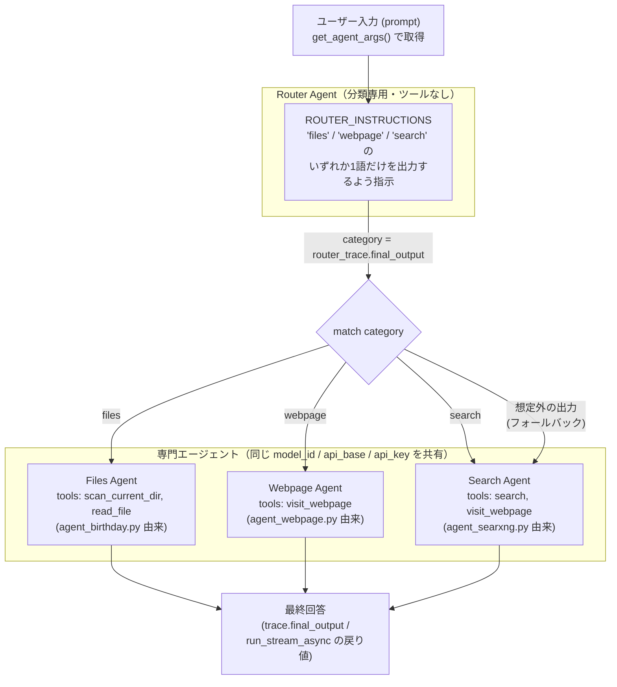

# ルーターパターン（agent_router.py / agent_router_stream.py）

ユーザー入力を分類専用の「ルーターエージェント」に判定させ、判定結果に応じて複数の「専門エージェント」のいずれかに処理を委譲するマルチエージェントパターンのサンプルです。`references/routing.py` の擬似コードを、このリポジトリの実際の `any-agent` API（`AgentConfig` / `AnyAgent.create("tinyagent", ...)` / `StreamingTinyAgent`）と `agent_config.get_agent_args()` に沿って実装したものが `agent_router.py`（同期版）・`agent_router_stream.py`（ストリーミング版）です。

## アーキテクチャ



**ポイント:**

- `model_id` / `api_base` / `api_key` は `agent_config.get_agent_args()` を**1回だけ**呼び出し、ルーターと3つの専門エージェントすべてで共有します（`references/routing.py` のようにエージェントごとに異なるモデル名をハードコードする設計ではなく、ローカル1バックエンド構成のこのリポジトリの流儀に合わせています）。
- Router Agent はツールを持たず、システムプロンプト（`ROUTER_INSTRUCTIONS`）だけで分類を行う「分類専用エージェント」です。
- 分類結果が3カテゴリのいずれにも一致しない場合は、最も汎用的な `search` エージェントにフォールバックします。
- 同期版はプロンプトを2回 `agent.run()` する（ルーター判定→専門エージェント実行）だけのシンプルな構成、ストリーミング版は `StreamingTinyAgent.run_stream_async()` でルーター判定・専門エージェントの回答の両方をトークン単位でライブ表示します。

## カテゴリと担当エージェント

| カテゴリ | 説明 | ツール | 流用元 |
|---|---|---|---|
| `files` | 答えがカレントディレクトリのローカルファイルにある | `scan_current_dir`, `read_file` | `agent_birthday.py` |
| `webpage` | 特定のURLの内容を取得・要約する | `visit_webpage` | `agent_webpage.py` |
| `search` | 検索が必要（URL未指定 / 最新情報が必要） | `search`（SearXNG）, `visit_webpage` | `agent_searxng.py` |

## サンプルプロンプト（カテゴリ別）

それぞれ対応する専門エージェントに振り分けられることを確認済みのプロンプト例です。

### `files` に振り分けられる例

```bash
uv run agent_router.py "Look in the current directory for a local file containing information about Davide Eynard's birthday and read it."
```

ルーターが `files` と判定 → `scan_current_dir` で `*.csv` を検索 → `read_file` で `birthdays.csv` を読み込み →
「According to the file, Davide Eynard's birthday is on 11/02/1976.」のように回答します。

デフォルトプロンプト（引数なしで実行した場合の `"When was Davide Eynard born?"`）も多くの場合 `files` に分類されますが、
質問文だけでは `search` と判定されることもあります（小型モデルの分類揺れ）。確実に `files` を試したい場合は上記のように
「ローカルファイルを探して」と明示すると安定します。

### `webpage` に振り分けられる例

```bash
uv run agent_router.py "Summarize the page at https://example.com"
```

ルーターが `webpage` と判定 → `visit_webpage` で指定URLを取得・Markdown変換 → 内容を要約して回答します。

### `search` に振り分けられる例

```bash
uv run agent_router.py "Who are the speakers for OxML 2026 MLx Cases?"
```

ルーターが `search` と判定 → `search`（SearXNG）で検索 → 関連URLを `visit_webpage` で訪問 → 内容をまとめて回答します。
**このカテゴリの実行には SearXNG が起動している必要があります**（`docker compose up -d`。詳細はルート `README.md` の
「SearXNG のセットアップ」を参照）。SearXNG が起動していない場合、`search` ツール呼び出しはタイムアウトエラーを返します。

## ストリーミング版

同じプロンプトを `agent_router_stream.py` に渡すと、ルーターの分類結果・ツール呼び出し・最終回答がすべてトークン単位で
ライブ表示されます。

```bash
uv run agent_router_stream.py "Look in the current directory for a local file containing information about Davide Eynard's birthday and read it."
```

```
files
[router] category: files

---

[tool: scan_current_dir({'pattern': '*.csv'})]

[tool: read_file({'file_name': 'birthdays.csv'})]
According to the file, Davide Eynard's birthday is on 11/02/1976.

Final: According to the file, Davide Eynard's birthday is on 11/02/1976.
```

## `references/routing.py` との違い

`references/routing.py` は `any_agent.Agent(name=, model=, system_prompt=)` という実在しない仮想APIを使った擬似コードで、
モデル名（`gpt-4o` など）もエージェントごとにハードコードされています。`agent_router.py` / `agent_router_stream.py` は
これを実際の `any-agent` API・`agent_config.py` 経由のモデル設定に置き換えた、動作する実装です。ルーティングの考え方
（分類専用エージェント→`match` 文で専門エージェントに委譲、想定外カテゴリはフォールバック）自体は `references/routing.py`
のものを踏襲しています。
